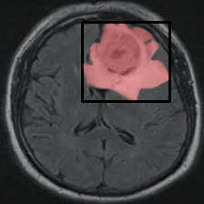

# Tumor Detection with U-Net Segmentation

## Overview

This project focuses on Tumor Detection in brain MRI images using the U-Net segmentation architecture. The dataset used for training and evaluation is sourced from Kaggle, specifically the "LGG Brain MRI Segmentation" dataset by Mateusz Buda. The U-Net model is a convolutional neural network commonly used for image segmentation tasks.

## Dataset

The dataset can be downloaded from Kaggle: [LGG Brain MRI Segmentation](https://www.kaggle.com/mateuszbuda/lgg-mri-segmentation)

Please make sure to review and comply with the dataset's license and terms.


## Installation

1. Clone the repository:

    ```bash
    git clone https://github.com/AJustiago/Tumor-Detection.git
    cd Tumor-Detection
    ```

2. Install dependencies:

    ```bash
    pip install -r requirements.txt
    ```
## Acknowledgments

1. **Dataset**: Special thanks to Mateusz Buda for providing the LGG-MRI Segmentation dataset on Kaggle. You can find the dataset [here](https://www.kaggle.com/datasets/mateuszbuda/lgg-mri-segmentation).

2. **U-Net**: The U-Net architecture used in this project for image segmentation is based on the work of Olaf Ronneberger, Philipp Fischer, and Thomas Brox. Read more about U-Net in their paper [here](https://arxiv.org/abs/1505.04597).
